# Nike Product Intelligence Architecture

This is the component architecture for the local Nike scraping demo. The agent
flow is documented separately in `docs/project-flow.md`; this diagram focuses on
system boundaries, runtime components, secrets, artifacts, and data movement.

```mermaid
%%{init: {
  "theme": "base",
  "flowchart": {
    "htmlLabels": true,
    "curve": "basis",
    "nodeSpacing": 60,
    "rankSpacing": 80
  },
  "themeVariables": {
    "fontFamily": "Inter, ui-sans-serif, system-ui, -apple-system, BlinkMacSystemFont, Segoe UI, sans-serif",
    "fontSize": "19px",
    "primaryTextColor": "#f8fafc",
    "lineColor": "#94a3b8",
    "background": "#0b1020",
    "mainBkg": "#0f172a",
    "clusterBkg": "#111827",
    "clusterBorder": "#475569",
    "edgeLabelBackground": "#0b1020"
  }
}}%%
flowchart LR
    subgraph USER["<b>User + Local Machine</b>"]
        Browser["<b>Browser</b><br/>Paperclip UI<br/>http://127.0.0.1:3100/NIK"]
        CLI["<b>Terminal / Scripts</b><br/>preflight, seed, crawl,<br/>monitor, cost analysis"]
        Env["<b>Local Environment</b><br/>.env + Paperclip Local env<br/>ANTHROPIC_API_KEY<br/>ZYTE_API_KEY"]
    end

    subgraph CONTROL["<b>Paperclip Control Plane</b>"]
        Company["<b>Nike Product Intelligence</b><br/>company, goal, project"]
        Agents["<b>Five Agents</b><br/>Coordinator, ScrapyBuilder,<br/>QAReviewer, Monitor, CostAnalyst"]
        Issues["<b>Work State</b><br/>issues, approvals, routines,<br/>activity, artifacts"]
    end

    subgraph BUILD["<b>Build-Time Generation</b>"]
        Claude["<b>Claude Code</b><br/>local agent runtime"]
        ZyteSkills["<b>Zyte Claude Skills</b><br/>schema discovery, review,<br/>spec, codegen, spider wiring"]
        Generated["<b>Generated Scrapy Project</b><br/>nike_catalog"]
    end

    subgraph SCRAPY["<b>Scrapy Extraction Engine</b>"]
        Spider["<b>Nike Spider</b><br/>public /id/t/... PDP seeds"]
        Parser["<b>Parser</b><br/>JSON-LD ProductGroup / Product<br/>visible-page fallbacks"]
        Pipeline["<b>Stats Pipeline</b><br/>required fields + duplicate URL stats"]
        Settings["<b>Settings</b><br/>scrapy-zyte-api addon<br/>Spidermon enabled"]
    end

    subgraph ACCESS["<b>Access / Rendering Layer</b>"]
        ZyteAPI["<b>Zyte API</b><br/>browserHtml reliability path<br/>request stats"]
        Nike["<b>Nike Public Pages</b><br/>robots-reviewed PDP URLs<br/>no account / checkout / restricted paths"]
    end

    subgraph QUALITY["<b>Quality + Monitoring</b>"]
        Spidermon["<b>Spidermon</b><br/>minimum items<br/>required fields<br/>duplicates<br/>Zyte API processed<br/>fatal errors"]
        Health["<b>Health Report</b><br/>outputs/nike/latest/health.json<br/>reports/nike/latest-health.json"]
        QA["<b>QA Decision</b><br/>local repair vs structural rebuild"]
    end

    subgraph OUTPUTS["<b>Artifacts + Reports</b>"]
        Products["<b>Products</b><br/>outputs/nike/latest/products.jsonl"]
        Logs["<b>Logs</b><br/>outputs/nike/latest/crawl.log"]
        Cost["<b>Cost Report</b><br/>reports/nike/latest-cost-analysis.md"]
        Diagrams["<b>Docs / Diagrams</b><br/>project-flow.md<br/>project-flow-dark.excalidraw<br/>architecture.md"]
    end

    Browser --> Company
    CLI --> Env
    Env --> Claude
    Env --> ZyteAPI
    Company --> Agents --> Issues

    Agents -->|"build mode"| Claude
    Claude --> ZyteSkills --> Generated
    Generated --> Spider
    Generated --> Parser
    Generated --> Settings

    Agents -->|"run mode"| CLI
    CLI --> Spider
    Settings --> Spider
    Spider --> ZyteAPI --> Nike
    Nike --> ZyteAPI --> Spider
    Spider --> Parser --> Products
    Parser --> Pipeline
    Pipeline --> Spidermon
    Spider --> Logs
    Logs --> Spidermon
    Spidermon --> Health --> QA
    QA -->|"healthy"| Issues
    QA -->|"local fix"| Generated
    QA -->|"structural drift"| Agents

    Logs --> Cost
    Products --> Cost
    Agents -->|"cost mode"| Cost
    Cost --> QA
    Health --> Issues
    Products --> Issues
    Logs --> Issues
    Diagrams --> Issues

    classDef local fill:#1e3a8a,stroke:#60a5fa,color:#f8fafc,stroke-width:2px,font-size:19px;
    classDef control fill:#4c1d95,stroke:#c4b5fd,color:#faf5ff,stroke-width:2px,font-size:19px;
    classDef build fill:#064e3b,stroke:#34d399,color:#ecfdf5,stroke-width:2px,font-size:19px;
    classDef scrapy fill:#075985,stroke:#38bdf8,color:#f0f9ff,stroke-width:2px,font-size:19px;
    classDef external fill:#713f12,stroke:#facc15,color:#fefce8,stroke-width:2px,font-size:19px;
    classDef quality fill:#581c87,stroke:#d8b4fe,color:#faf5ff,stroke-width:2px,font-size:19px;
    classDef artifact fill:#14532d,stroke:#86efac,color:#f0fdf4,stroke-width:2px,font-size:19px;

    class Browser,CLI,Env local;
    class Company,Agents,Issues control;
    class Claude,ZyteSkills,Generated build;
    class Spider,Parser,Pipeline,Settings scrapy;
    class ZyteAPI,Nike external;
    class Spidermon,Health,QA quality;
    class Products,Logs,Cost,Diagrams artifact;
```

## Key Boundaries

- **Paperclip** owns coordination, approvals, routine state, issues, and repair
  ownership. It is the control plane, not the extraction engine.
- **Claude Code + Zyte skills** are build-time generation tools. They should run
  for first build, schema changes, or confirmed structural drift.
- **Scrapy** is the runtime extraction engine. Normal runs reuse the existing
  spider instead of regenerating code.
- **Zyte API** is the access/rendering layer. It supplies rendered access and
  emits usage/error stats consumed by monitoring and cost review.
- **Spidermon + health reports** are runtime guardrails. They decide whether a
  run is healthy enough or should create QA repair work.
- **Cost analysis** reviews the current spider and job evidence for high-impact
  savings such as avoiding browser rendering when JSON-LD is available without
  it.

## Primary Runtime Paths

1. **Build path**: Paperclip `ScrapyBuilder` -> Claude Code -> Zyte skills ->
   generated `nike_catalog` project.
2. **Run path**: Paperclip `Monitor` -> `scripts/monitor-nike-crawl.sh` ->
   Scrapy spider -> Zyte API -> Nike public PDPs -> `products.jsonl`.
3. **Quality path**: Scrapy stats/logs -> Spidermon -> `health.json` ->
   QAReviewer -> local repair or rebuild escalation.
4. **Cost path**: crawl log + spider/settings -> cost analyzer or
   `/scrapy-cost-analysis` -> CostAnalyst recommendations -> QA validation.
