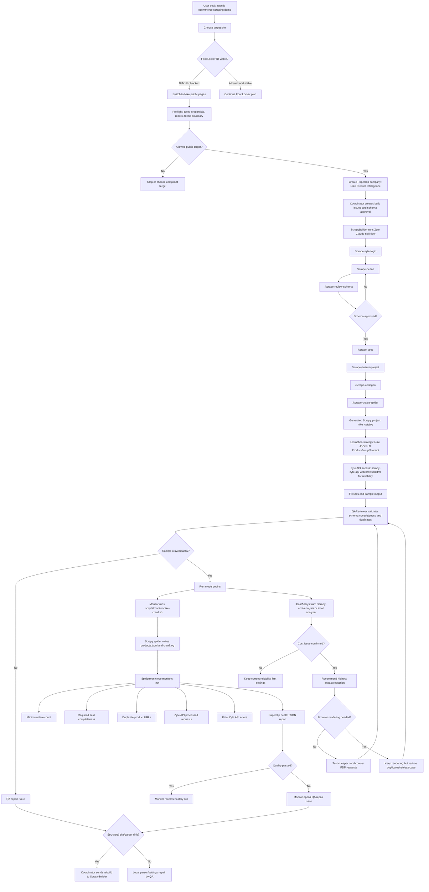

# Nike Paperclip Scrapy Demo Flow

This diagram captures the decisions we made while building the demo: Paperclip
as control plane, Zyte Claude skills as the build workflow, Scrapy as extraction
engine, Zyte API as access/rendering layer, Spidermon as runtime guardrail, and
cost analysis as the optimization lane.

## Why Paperclip

Paperclip is the control plane because it keeps the human-visible state:
company, goal, agents, issues, approvals, routines, and repair ownership. The
important design decision is that Paperclip does not scrape by itself. It routes
work to the right specialist:

- `Coordinator` decides build mode vs run mode.
- `ScrapyBuilder` only runs for a new site, schema change, or structural drift.
- `Monitor` runs the existing spider and creates repair work when quality drops.
- `QAReviewer` diagnoses failures before escalating to a rebuild.
- `CostAnalyst` reviews Zyte API cost risks before deployment or when spend rises.

## Build Mode

Build mode is expensive and should be rare. It uses Zyte Claude skills to
discover the site, approve the schema, generate page objects, wire the spider,
and create fixtures.

## Run Mode

Run mode is the daily loop. It should not call ScrapyBuilder or regenerate code.
It runs the existing spider, captures artifacts, executes Spidermon, writes a
health report, and routes failures to QA.

## Cost Mode

Cost mode is an optimization loop. It reviews browser rendering, Zyte API
automation, retries, duplicate requests, pagination, job stats, and request/item
ratios. For this Nike demo, the first hypothesis is whether JSON-LD extraction
works without `browserHtml=True`.
