# Web Scraping System Loop

This is the systems-thinking view of the Nike Product Intelligence demo. It
shows the scraper as a living operating system, not a one-off script.

## The Core Idea

A mature web scraping system is not just:

```text
run spider -> get data
```

It is a loop:

```text
define goal -> build scraper -> run scraper -> observe quality -> diagnose
-> repair or optimize -> run again
```

Paperclip gives that loop a control plane. Scrapy performs extraction. Zyte API
handles access. Spidermon checks quality. QA and cost analysis decide what
should change.

## Whole System Loop

```mermaid
%%{init: {
  "theme": "base",
  "flowchart": {
    "htmlLabels": true,
    "curve": "basis",
    "nodeSpacing": 55,
    "rankSpacing": 70
  },
  "themeVariables": {
    "fontFamily": "Inter, ui-sans-serif, system-ui, -apple-system, BlinkMacSystemFont, Segoe UI, sans-serif",
    "fontSize": "19px",
    "primaryTextColor": "#f8fafc",
    "lineColor": "#94a3b8",
    "background": "#0b1020",
    "mainBkg": "#0f172a",
    "clusterBkg": "#111827",
    "clusterBorder": "#475569",
    "edgeLabelBackground": "#0b1020"
  }
}}%%
flowchart LR
    A["<b>Business Question</b><br/>What product intelligence do we need?"]
    B["<b>Control Plane</b><br/>Paperclip company, agents,<br/>issues, routines, approvals"]
    C["<b>Build Capability</b><br/>Zyte Claude skills + ScrapyBuilder<br/>create or rebuild spider"]
    D["<b>Extraction Engine</b><br/>Scrapy spider + parser<br/>Nike JSON-LD product data"]
    E["<b>Access Layer</b><br/>Zyte API<br/>HTTP response by default<br/>browser fallback when needed"]
    F["<b>Raw Signals</b><br/>products.jsonl<br/>crawl.log<br/>Scrapy stats"]
    G["<b>Quality Guardrail</b><br/>Spidermon + health.json<br/>items, fields, duplicates, errors"]
    H{"<b>Healthy?</b>"}
    I["<b>Use Data</b><br/>latest products available<br/>routine succeeds"]
    J["<b>QA Diagnosis</b><br/>data problem, parser drift,<br/>access issue, or rebuild?"]
    K{"<b>Structural Drift?</b>"}
    L["<b>Local Repair</b><br/>parser, seed URLs, settings,<br/>monitor thresholds"]
    M["<b>Rebuild Loop</b><br/>Coordinator sends to ScrapyBuilder<br/>run Zyte skill flow again"]
    N["<b>Cost Review</b><br/>browser rendering, retries,<br/>duplicates, request/item ratio"]
    O{"<b>Cost Too High?</b>"}
    P["<b>Optimize</b><br/>cheaper Zyte API mode,<br/>dedupe, reduce retries/scope"]
    Q["<b>Learning</b><br/>update runbooks, diagrams,<br/>agent instructions, acceptance checks"]

    A --> B --> C --> D --> E --> F --> G --> H
    H -->|"yes"| I
    H -->|"no"| J --> K
    K -->|"no"| L --> D
    K -->|"yes"| M --> C
    I --> N
    G --> N
    N --> O
    O -->|"yes"| P --> J
    O -->|"no"| Q
    J --> Q
    P --> Q
    Q --> B

    classDef business fill:#1e3a8a,stroke:#60a5fa,color:#f8fafc,stroke-width:2px,font-size:19px;
    classDef control fill:#4c1d95,stroke:#c4b5fd,color:#faf5ff,stroke-width:2px,font-size:19px;
    classDef build fill:#064e3b,stroke:#34d399,color:#ecfdf5,stroke-width:2px,font-size:19px;
    classDef run fill:#075985,stroke:#38bdf8,color:#f0f9ff,stroke-width:2px,font-size:19px;
    classDef quality fill:#581c87,stroke:#d8b4fe,color:#faf5ff,stroke-width:2px,font-size:19px;
    classDef decision fill:#713f12,stroke:#facc15,color:#fefce8,stroke-width:3px,font-size:20px;
    classDef improve fill:#7c2d12,stroke:#fb923c,color:#fff7ed,stroke-width:2px,font-size:19px;
    classDef success fill:#14532d,stroke:#86efac,color:#f0fdf4,stroke-width:2px,font-size:19px;

    class A business;
    class B control;
    class C,M build;
    class D,E,F run;
    class G,J quality;
    class H,K,O decision;
    class N,P,Q improve;
    class I,L success;
```



## How A Systems Thinker Explains It

The project has five connected loops.

### 1. Build Loop

Purpose: create the scraper when the target is new or structurally changed.

```text
Need scraper -> define schema -> generate spider -> validate sample -> approve
```

In our project:

- `ScrapyBuilder` owns this loop.
- Zyte Claude skills help define schema and generate code.
- The output is the `nike_catalog` Scrapy project.

Important principle:

> Build mode should be rare. Once the scraper exists, do not regenerate it on
> every run.

### 2. Run Loop

Purpose: run the existing scraper repeatedly.

```text
Monitor routine -> run Scrapy -> write products/logs -> update latest artifacts
```

In our project:

- `Monitor` owns this loop.
- `scripts/monitor-nike-crawl.sh` runs the spider.
- Outputs go to `outputs/nike/latest/`.

Important principle:

> Routine operation should be boring, repeatable, and cheap.

### 3. Quality Loop

Purpose: detect whether the data is trustworthy.

```text
Scrapy stats + output -> Spidermon checks -> health report -> pass/fail
```

In our project, Spidermon checks:

- minimum product count
- required field completeness
- duplicate product URLs
- Zyte API processed requests
- fatal Zyte API errors

Important principle:

> A crawler that runs is not enough. The system must know whether the output is
> useful.

### 4. Repair Loop

Purpose: decide what kind of failure happened.

```text
health failure -> QA diagnosis -> local repair or structural rebuild
```

In our project:

- `QAReviewer` decides whether the issue is local or structural.
- Local repair means parser/settings/seed changes.
- Structural drift goes back to `Coordinator`, then `ScrapyBuilder`.

Important principle:

> Do not send every failure to the builder. Diagnose first.

### 5. Cost Loop

Purpose: keep the system economically sane.

```text
crawl logs + spider settings -> cost analysis -> optimize or keep stable
```

In our project:

- `CostAnalyst` checks browser rendering, retries, duplicate requests, and
  request/item ratio.
- We changed the Nike spider so browser rendering is not default.
- Browser mode is now a fallback:

```sh
NIKE_USE_BROWSER=true ./scripts/monitor-nike-crawl.sh
```

Important principle:

> Reliability matters, but expensive reliability should be explicit.

## The Roles In One Sentence Each

- **Coordinator**: decides which loop should run next.
- **ScrapyBuilder**: builds or rebuilds the scraper.
- **Monitor**: runs the existing scraper and records health.
- **QAReviewer**: decides whether a failure is local repair or rebuild-worthy.
- **CostAnalyst**: keeps the crawler from becoming unnecessarily expensive.

## What Makes The System Agentic

The agentic part is not that an LLM writes code once.

The agentic part is that the system has roles, memory, artifacts, routines,
decisions, and feedback:

```text
agents observe -> decide -> act -> produce evidence -> update state
```

Paperclip is useful because it makes those actions visible and stateful.

## What This Can Become

The same loop can be reused for other ecommerce targets:

```text
New site -> build scraper -> run daily -> monitor quality -> repair drift
-> optimize cost -> document learnings
```

This pattern is useful for:

- product catalog intelligence
- price monitoring
- availability tracking
- competitor analysis
- marketplace monitoring
- long-running scraper maintenance
- QA and cost governance for scraping teams

## The Short Pitch

This project is a small operating model for web scraping.

Instead of treating scraping as a script, we treat it as a system:

```text
control plane + extraction engine + access layer + quality monitor
+ repair loop + cost loop
```

That is the part worth showing to developers.
